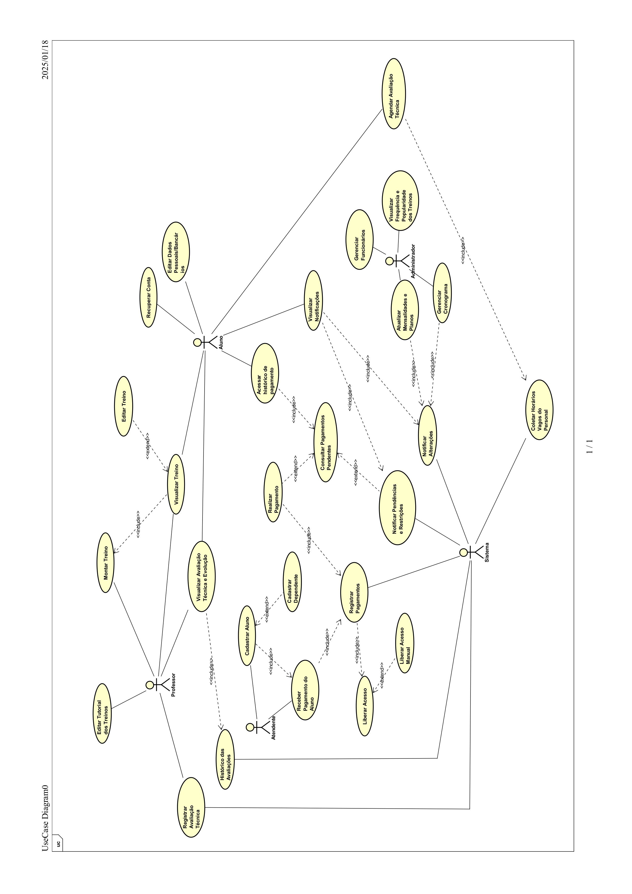

# Gym-System-UML

## Índice
1. [Levantamento de Requisitos](#levantamento-de-requisitos)
2. [Diagramas](#diagramas)
   - [Diagrama de Caso de Uso](#diagrama-de-caso-de-uso)

 

## Levantamento de Requisitos

### Requisitos Funcionais
| **RF**   | **Descrição**                                                                                                                                                                                                     |
|----------|-------------------------------------------------------------------------------------------------------------------------------------------------------------------------------------------------------------------|
| RF001    | O sistema deve cadastrar o aluno, somente presencialmente com o atendente (CPF, Nome, data de nascimento, telefone, e-mail, preferências de treino). Caso tenha mais pessoas da família, opta pelo plano familiar e adicione os seus dependentes. |
| RF002    | O sistema deve liberar o acesso aos recursos da academia para o aluno quando fizer o pagamento da mensalidade.                                                                                                   |
| RF003    | O sistema deve permitir ao aluno que edite seus dados pessoais (Nome, telefone, preferência de treino), como também atualizar seus dados bancários.                                                              |
| RF004    | O sistema deve permitir ao aluno recuperar o acesso da sua conta por meio de e-mail (Envio de um link para alterar a senha).                                                                                     |
| RF005    | O sistema deve possibilitar que somente o professor registre os dados da avaliação técnica dos alunos (Índice de Massa Corporal (IMC), peso, altura, percentual de gordura e quantidade de massa muscular), guardando em um histórico (Sendo realizado a cada 6 meses caso o aluno queira). |
| RF006    | O sistema deve permitir que o aluno agende a avaliação técnica, com disponibilidade baseada nos horários dos professores.                                                                                        |
| RF007    | O sistema deve permitir ao aluno que veja as avaliações técnicas e sua evolução.                                                                                                                                |
| RF008    | O sistema deve permitir todo os alunos que visualize o cronograma da academia (Horários de treinos, eventos e feriados).                                                                                         |
| RF009    | O sistema deve permitir ao professor que registre o treino do aluno, marcando o professor que fez o registro.                                                                                                   |
| RF010    | O sistema deve permitir aos professores que possa editar os treinos colocando vídeos ou guias para os alunos.                                                                                                   |
| RF011    | O sistema deve permitir ao aluno que possa ver seu treino.                                                                                                                                                       |
| RF012    | O sistema deve permitir ao aluno que edite o seu treino ou montar um do zero.                                                                                                                                    |
| RF013    | O sistema deve registrar os históricos dos treinos.                                                                                                                                                              |
| RF014    | O sistema deve enviar uma notificação da mensalidade (Por meio de e-mail com um prazo de uma semana antes, três dias antes e no dia do vencimento), permitindo pagamento por boleto, PIX, cartão de crédito/débito. Caso seja pago em dinheiro, o atendente deve marcar no sistema o pagamento. |
| RF015    | O sistema deve permitir ao aluno que acesse o historio de pagamentos realizados e pendentes (Data, método de pagamento e valor).                                                                                 |
| RF016    | O sistema deve liberar a passagem do aluno da catraca, caso as mensalidades estejam pagas. Se ocorrer alguma falha no sistema, o atendente poderá liberar manualmente.                                           |
| RF017    | O sistema deve permitir ao aluno que veja seus status financeiros.                                                                                                                                               |
| RF018    | O sistema deve bloquear o aluno caso tenha mensalidades pendentes e avisa-lo por meio de e-mail, no app/site permite visualizar a mensalidade pendente.                                                          |
| RF019    | O sistema deve permitir ao administrador que gerencie os funcionários com a criação das contas e se é Professor ou Atendente.                                                                                    |
| RF020    | O sistema deve permitir ao administrador que veja os históricos das frequências dos alunos e popularidade nos treinos.                                                                                           |
| RF021    | O sistema deve permitir ao administrador que atualize as mensalidades e planos da academia e avise os alunos (Por meio de e-mail) com um mês de antecedência a mudança.                                           |
| RF022    | O sistema deve permitir ao administrador que adicione o cronograma da academia, notificando caso ocorra algum evento ou feriado pelo e-mail.                                                                     |

### Requisitos Não Funcionais
| **RNF**   | **Descrição**                                                                                                                                                     |
|-----------|-------------------------------------------------------------------------------------------------------------------------------------------------------------------|
| RNF001    | O sistema deve utilizar o SGBD MySQL para armazenar os dados.                                                                                                     |
| RNF002    | O sistema deve integrar o processamento de pagamentos por meio da API Stripe.                                                                                     |
| RNF003    | O BACKEND do sistema deve ser implementado em Node.JS ou Java com Spring Boot, garantindo escalabilidade e desempenho na camada de serviços.                       |
| RNF004    | O site do sistema deve ser desenvolvido em HTML, CSS e JavaScript.                                                                                                |
| RNF005    | O aplicativo deve ser desenvolvido para plataforma Android utilizando Kotlin como linguagem principal.                                                            |
| RNF006    | O sistema destinado aos atendentes deve ser uma aplicação desktop desenvolvido em Java, garantindo uma interface responsiva.                                      |
| RNF007    | A API deve ser implementada em um servidor executando o SO Linux Debian.                                                                                          |

 

## Diagramas

### **Diagrama de Caso de Uso**
